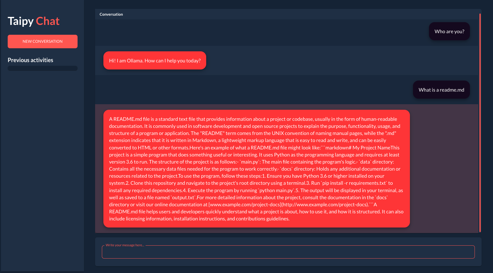
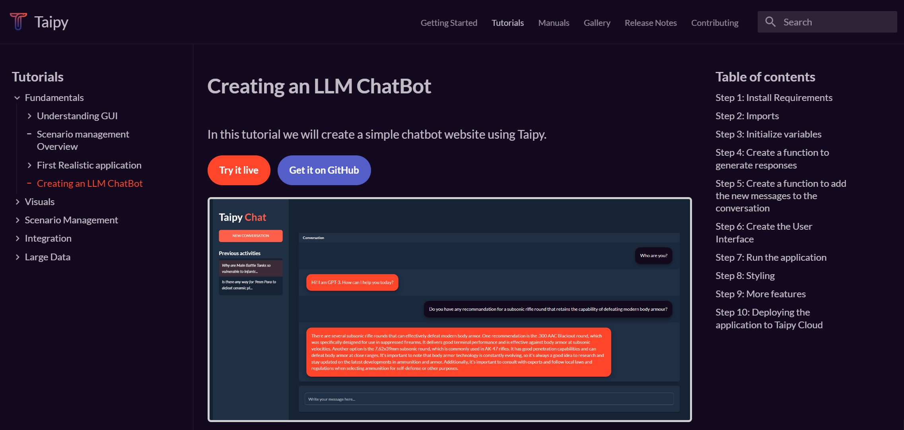

# Taipy OLLAMA Chat Demo

<p align="center">
  
</p>

A simple app to chat with an LLM which can be used to create any LLM Inference Web Apps using Python only.

This particular app uses OpenAI's GPT-4 API to generate responses to your messages. You can easily change the code to use any other API or model.

## Tutorial

A tutorial on how to create this app is available in the <a href="https://docs.taipy.io/en/release-3.0/knowledge_base/tutorials/chatbot/" target="_blank">Taipy documentation</a>

<p align="center">
  
</p>


## How to Use

**You need an Ollama installed and the default model is starling-lm <a href="https://ollama.ai" target="_blank">Get Ollama</a>**

1. Clone this repo:

```bash	
git clone https://github.com/rapidarchitect/ollama_taipy
```

2. Install dependencies:

```bash
pip install -r requirements.txt
```

3. If you dont have starling-lm installed alread:

```bash
ollama pull starling-lm:beta
```

OR you can change the MODEL="starling-lm:beta" at the top of the file to the model you want to use

4. Then run the code, if you want to run on a different port number feel free

```bash
python3 main.py --port 5001
```
